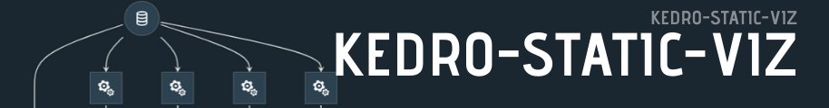
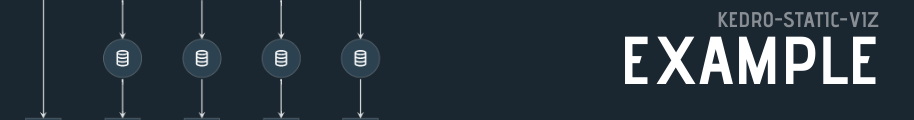
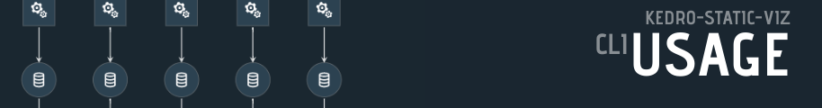
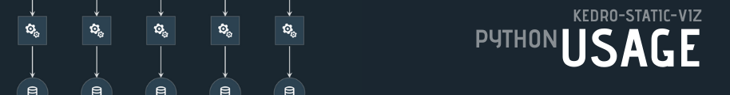
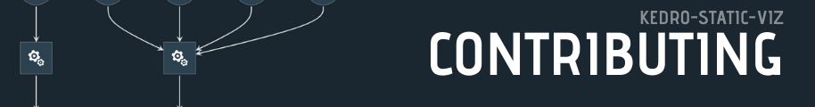
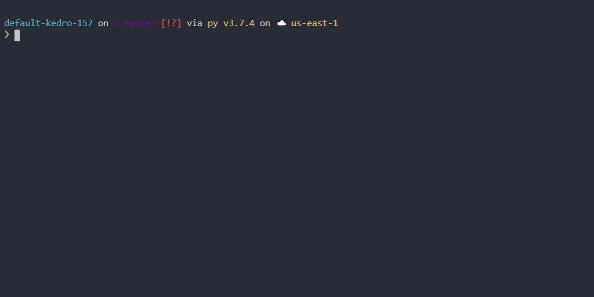
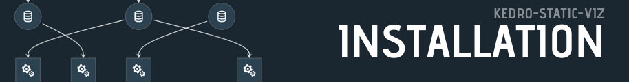
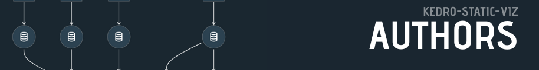
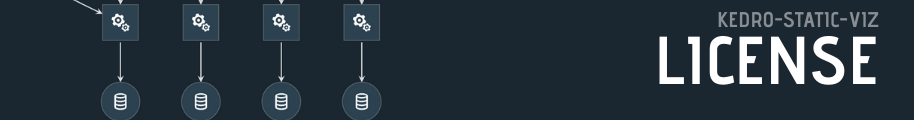

# [](https://static-viz.kedro.dev)

Kedro-Static-Viz creates a static website for your [Kedro](https://github.com/quantumblacklabs/kedro) data pipelines.  Kedro static viz is a very small python cli that makes your kedro-viz generated pipeline.json data available to a static appication built with gatsbyjs.  The benefit of this is that it it can be built inside of a ci service such as github actions and deployed to a number to static file hosts such as Netlify, Now.sh, github pages, S3.  Free options are endless these days.  By default the site will be built to the `public` directory.


[](https://badge.fury.io/py/kedro-static-viz)


---

## 


On every push to master in this repo [static-viz.kedro.dev](https://static-viz.kedro.dev) is built and deployed.

## 

```
kedro static-viz
```

## !

The `static_viz` function is callable from inside your project directory.

```python
from kedro_static_viz import static_viz
static_viz()
```

## 

``` python
from kedro_static_viz.hooks import StaticViz

class ProjectContext(KedroContext):
   project_name = "kedro0160"
   project_version = "0.16.1"
   package_name = "kedro0160"
   hooks = [ StaticViz() ]
```



## 


## How do I install and use Kedro-Static-Viz?


### As a Kedro Python plugin

Kedro-Static-Viz is available as a Python plugin named `kedro-static-viz`.

The following conditions must be true in order to visualise your pipeline:

- Your project directory must be available to the Kedro-Static-Viz plugin.
- You must be using a [Kedro](https://github.com/quantumblacklabs/kedro) data pipelines project structure with a complete Data Catalog, nodes and pipeline structure.

To install it:

```bash
pip install kedro-static-viz
```

This will install `kedro` as a dependency, and add `kedro static-viz` as an additional CLI command.


To visualise your pipeline, go to your project root directory and install the project-specific dependencies by running:

```bash
kedro install
```

This will install the dependencies specified in `requirements.txt` in your Kedro environment (see [the Kedro documentation](https://kedro.readthedocs.io/en/latest/02_getting_started/01_prerequisites.html#python-virtual-environments) for how to set up your Python virtual environment).

Finally, run the following command from the project directory to visualise your pipeline:

```bash
kedro static-viz
```

This command will run kedro_viz.server on `http://127.0.0.1:4141/` which cannot be accessed from another machine.

Kedro-Viz has a number of options to customise running the visualisation:

| CLI command              | Description                                                                                                                                                                            |
|--------------------------|----------------------------------------------------------------------------------------------------------------------------------------------------------------------------------------|
| `--port`                 | TCP port that viz will listen to. Defaults to 4141.                                                                                                                                    |
| `--browser/--no-browser` | Whether to open viz interface in the default browser or not.                                                                                                                           |
| `--load-file`            | Path to load the pipeline JSON file                                                                                                                                                    |
| `--pipeline`             | Name of the [modular pipeline](https://kedro.readthedocs.io/en/latest/04_user_guide/06_pipelines.html#modular-pipelines) to visualise. If not set, the default pipeline is visualised. |
| `--env`, `-e`            | Kedro configuration environment. If not specified, catalog config in `local` will be used.                                                                                             |
| `--directory`            | Directory to render the static site to                                                                                                                                                 |
| `--serve/--no-serve`     | Whether or not to serve the site after creating. Defaults to True.                                                                                                                     |

## 

**You're Awesome** for considering a contribution!  Contributions are welcome, please check out the [Contributing Guide](./contributing.md) for more information.  Please be a positive member of the community and embrace feedback

## 

We use [SemVer](https://semver.org/) for versioning. For the versions available, see the [tags on this repository](./tags).


## 

[](https://github.com/WaylonWalker) - Waylon Walker - _Original Author_

## 

This project is licensed under the MIT License - see the LICENSE file for details
